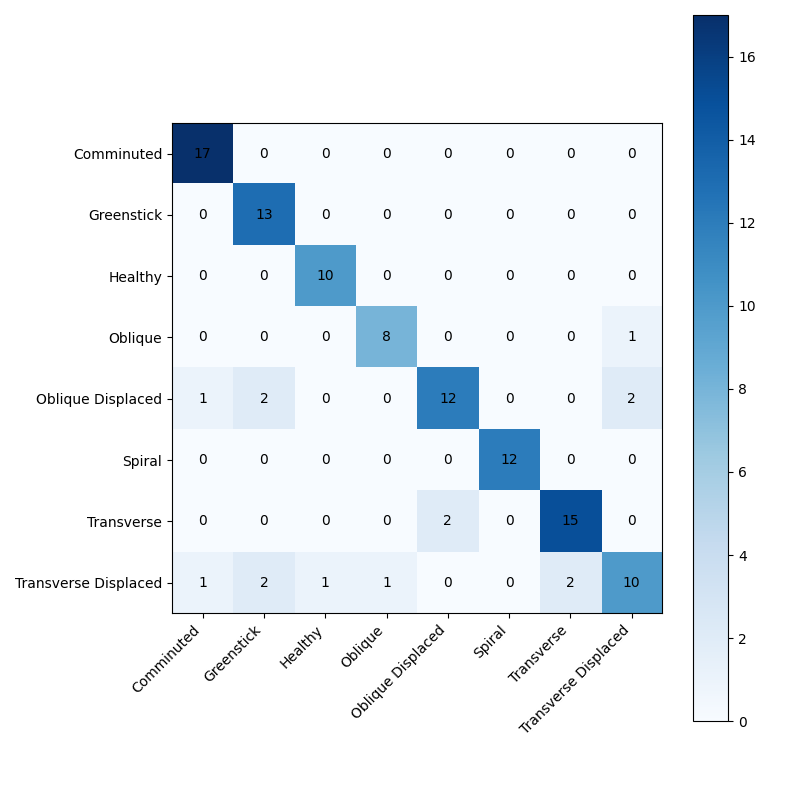
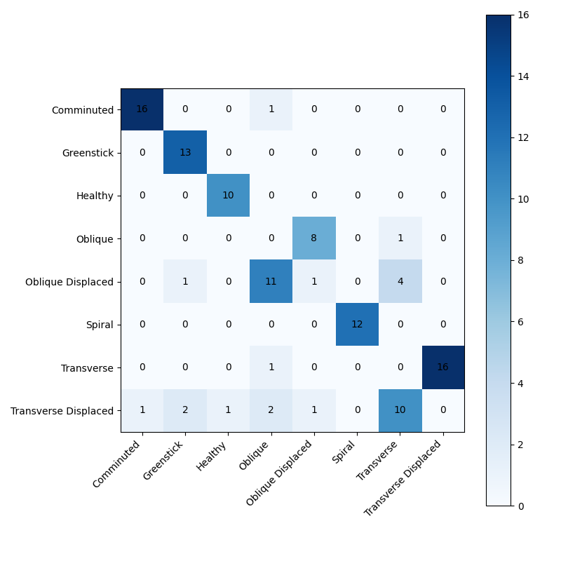

# Model Comparison: Old vs Improved

**Date:** 2025-11-30

## 1. Performance Summary

| Model | Macro F1 | Oblique F1 | Oblique Displaced F1 | Transverse F1 | Transverse Displaced F1 |
| :--- | :---: | :---: | :---: | :---: | :---: |
| **HyperColumn-DenseNet (Old)** | **0.872** | 0.889 | 0.774 | 0.882 | 0.667 |
| **HyperColumn-DenseNet (Improved)** | **0.483** | 0.000 | 0.074 | 0.000 | 0.000 |

## 2. Detailed Analysis

### HyperColumn-DenseNet (Old)
- **Checkpoint**: `best_hypercolumn_densenet169_old.pth`
- **Macro F1**: 0.8719

#### Per-Class Metrics
| Class | Precision | Recall | F1-Score |
| :--- | :---: | :---: | :---: |
| Comminuted | 0.895 | 1.000 | 0.944 |
| Greenstick | 0.765 | 1.000 | 0.867 |
| Healthy | 0.909 | 1.000 | 0.952 |
| Oblique | 0.889 | 0.889 | 0.889 |
| Oblique Displaced | 0.857 | 0.706 | 0.774 |
| Spiral | 1.000 | 1.000 | 1.000 |
| Transverse | 0.882 | 0.882 | 0.882 |
| Transverse Displaced | 0.769 | 0.588 | 0.667 |

---
### HyperColumn-DenseNet (Improved)
- **Checkpoint**: `hypercolumn_improved/best_improved.pth`
- **Macro F1**: 0.4830

#### Per-Class Metrics
| Class | Precision | Recall | F1-Score |
| :--- | :---: | :---: | :---: |
| Comminuted | 0.941 | 0.941 | 0.941 |
| Greenstick | 0.812 | 1.000 | 0.897 |
| Healthy | 0.909 | 1.000 | 0.952 |
| Oblique | 0.000 | 0.000 | 0.000 |
| Oblique Displaced | 0.100 | 0.059 | 0.074 |
| Spiral | 1.000 | 1.000 | 1.000 |
| Transverse | 0.000 | 0.000 | 0.000 |
| Transverse Displaced | 0.000 | 0.000 | 0.000 |

---
