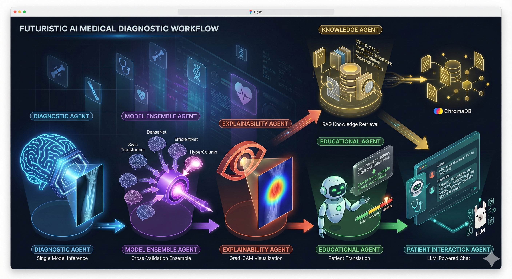
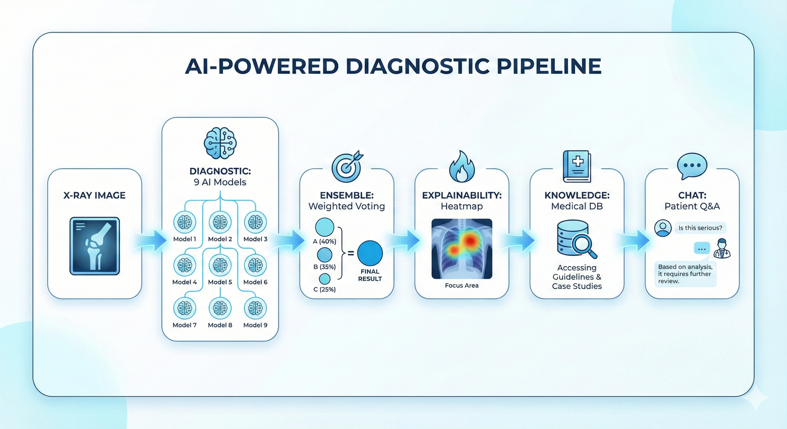

# MedAI - Explainable Multi-Agent Fracture Detection System

<p align="center">
  
  
  
  
</p>

A comprehensive medical imaging AI system for bone fracture detection using deep learning, featuring a **multi-agent architecture**, **explainable AI (XAI)** capabilities, and **RAG-powered knowledge retrieval**.

<p align="center">
  
</p>

---

## 🎯 Overview

MedAI is designed to assist healthcare professionals in diagnosing bone fractures from X-ray images. The system combines multiple state-of-the-art deep learning models in an ensemble approach, provides visual explanations of AI decisions, and offers patient-friendly translations of medical findings.

### Key Highlights

- 🧠 **11 Trained Models** working in ensemble for robust predictions
- 🎯 **Weighted Voting** with priority for specialized HyperColumn models on specific fracture types
- 🔥 **Grad-CAM Visualizations** showing exactly where the AI focuses
- 📚 **RAG Knowledge Base** powered by ChromaDB for medical information retrieval
- 💬 **LLM-Powered Chat** for patient Q&A using OpenRouter API
- 🏥 **Patient-Friendly Explanations** translating medical jargon
- 🌐 **Next.js Web Interface** for a modern, responsive user experience
- 📄 **Comprehensive Research Report** detailing the methodology and results

---

## � Web Interface & Report

The system now includes a modern web interface built with Next.js and a comprehensive research report.

- **Website**: Located in the `website/` directory, built with Next.js 14, Tailwind CSS, and Shadcn UI. It connects to a Python backend (e.g., deployed on Hugging Face Spaces) for inference.
- **Research Report**: A detailed report (`website/medai_diagnosis_report.pdf`) is available, documenting the methodology, model architectures, and evaluation results.

---

## �🏗️ System Architecture

### Multi-Agent Pipeline

<p align="center">
  
</p>

### Agent Descriptions

| Agent                         | Purpose                                                    | Key Technology                             |
| ----------------------------- | ---------------------------------------------------------- | ------------------------------------------ |
| **Diagnostic Agent**          | Single model inference for quick classification            | PyTorch, timm                              |
| **Ensemble Agent**            | Combines 9 models with intelligent weighted voting         | Soft voting, weighted averaging            |
| **Explainability Agent**      | Generates visual explanations of model decisions           | Grad-CAM, heatmap overlays                 |
| **Educational Agent**         | Translates technical findings to patient-friendly language | Template-based NLG                         |
| **Knowledge Agent**           | Retrieves relevant medical information                     | ChromaDB, RAG, embeddings                  |
| **Patient Interaction Agent** | Handles patient Q&A in conversational format               | OpenRouter API, Llama3, prompt engineering |

---

## 🦴 Fracture Classification

The system classifies X-ray images into **8 categories**:

| Class                    | Description                                                  | Severity        |
| ------------------------ | ------------------------------------------------------------ | --------------- |
| **Healthy**              | No fracture detected                                         | None            |
| **Greenstick**           | Incomplete fracture, bone bends but doesn't break completely | Mild            |
| **Transverse**           | Straight break across the bone                               | Moderate        |
| **Oblique**              | Angled break across the bone                                 | Moderate        |
| **Transverse Displaced** | Straight break with bone fragments shifted                   | Moderate-Severe |
| **Oblique Displaced**    | Angled break with bone fragments shifted                     | Moderate-Severe |
| **Spiral**               | Twisting fracture spiraling around the bone                  | Moderate-Severe |
| **Comminuted**           | Bone shattered into 3+ fragments                             | Severe          |

### Weighted Ensemble Voting

For **Oblique**, **Oblique Displaced**, **Transverse**, and **Transverse Displaced** fractures, the system gives priority to HyperColumn models which were specifically trained for these challenging cases. The exact hypercolumn weighting was tuned on the validation set (see calibration scripts below) and the current default is a neutral weight (1.0) after validation showed no consistent benefit from a higher multiplier.

```python
# Hypercolumn priority classes
HYPERCOLUMN_PRIORITY_CLASSES = {"Oblique", "Oblique Displaced", "Transverse", "Transverse Displaced"}
# Hypercolumn weight was tuned on validation (best found: 1.0)
HYPERCOLUMN_WEIGHT = 1.0
DEFAULT_WEIGHT = 1.0
```

---

## 🧠 Model Architectures

### Ensemble Members

| Model                                | Architecture           | Parameters | Specialty                                  |
| ------------------------------------ | ---------------------- | ---------- | ------------------------------------------ |
| `swin`                               | Swin Transformer Small | 50M        | Vision transformer with shifted windows    |
| `densenet169`                        | DenseNet-169           | 14M        | Dense connections for feature reuse        |
| `efficientnetv2`                     | EfficientNet-B0        | 5M         | Compound scaling architecture              |
| `mobilenetv2`                        | MobileNetV2            | 3.5M       | Lightweight mobile architecture            |
| `maxvit`                             | MaxViT Tiny            | 31M        | Multi-axis vision transformer              |
| `hypercolumn_cbam_densenet169`       | Custom                 | 20M        | DenseNet169 + Hypercolumn + CBAM attention |
| `hypercolumn_cbam_densenet169_focal` | Custom                 | 20M        | Above + Focal loss training                |
| `hypercolumn_densenet169`            | Custom                 | 18M        | DenseNet169 + Hypercolumn features         |
| `hypercolumn_densenet169_old`        | Custom                 | 18M        | Legacy hypercolumn model                   |
| `yolo`                               | YOLOv26 Classification | 26M        | Fast and accurate object classification    |
| `rad_dino`                           | Rad-DINO               | 86M        | Foundation model for medical imaging       |

### Model Benchmark Results

Based on the latest evaluation (`outputs/model_benchmark.csv`), the models perform as follows:

| Model                                       | Accuracy | F1 Macro | Best Logic |
| ------------------------------------------- | -------- | -------- | ---------- |
| `best_maxvit.pth`                           | 96.23%   | 96.61%   | Fixed      |
| `weights/best.pt` (YOLO)                    | 93.40%   | 93.82%   | YOLO       |
| `best_hypercolumn_cbam_densenet169.pth`     | 93.40%   | 93.65%   | Original   |
| `best_rad_dino_classifier.pth`              | 92.45%   | 93.11%   | RadDino    |
| `best_swin.pth`                             | 92.45%   | 93.11%   | Original   |
| `best_mobilenetv2.pth`                      | 91.51%   | 91.81%   | Fixed      |
| `best_efficientnetv2.pth`                   | 90.57%   | 91.26%   | Fixed      |
| `best_densenet169.pth`                      | 89.62%   | 90.49%   | Fixed      |
| `best_hypercolumn_densenet169.pth`          | 48.11%   | 49.60%   | Original   |
| `best_hypercolumn_cbam_densenet169_old.pth` | 47.17%   | 49.76%   | Original   |
| `best_hypercolumn_densenet169_old.pth`      | 47.17%   | 49.76%   | Original   |

### Custom HyperColumn-CBAM Architecture

```
Input Image (224×224×3)
         │
         ▼
┌─────────────────────────────────────┐
│     DenseNet169 Backbone            │
│  ┌─────────┬─────────┬─────────┐   │
│  │ Block 1 │ Block 2 │ Block 3 │   │
│  │  128ch  │  256ch  │  640ch  │   │
│  └────┬────┴────┬────┴────┬────┘   │
│       │         │         │        │
│       └─────────┴─────────┴────────┼──▶ Hypercolumn Fusion (2688ch)
│                                    │              │
│              Block 4 (1664ch) ─────┘              ▼
└─────────────────────────────────────┐    1×1 Conv (1024ch)
                                      │              │
                                      │              ▼
                                      │    ┌─────────────────┐
                                      │    │  CBAM Attention │
                                      │    │ Channel + Space │
                                      │    └────────┬────────┘
                                      │             │
                                      │             ▼
                                      │    Global Avg Pool
                                      │             │
                                      │             ▼
                                      │    FC (1024 → 8 classes)
                                      └─────────────────────────
```

---

## 📁 Project Structure

```
MedAI-ExplainableFractureDetection/
├── 📂 website/                          # Next.js web interface
│   ├── 📄 package.json
│   ├── 📄 README.md
│   └── 📄 medai_diagnosis_report.pdf    # Comprehensive research report
│
├── 📂 backend_hf/                       # Hugging Face Spaces backend
│   ├── 🐍 app.py
│   └── 📄 requirements.txt
│
├── 📂 src/
│   └── 📂 medai/
│       ├── 🐍 app.py                    # Main Streamlit application (all agents)
│       ├── 📂 agents/                   # Modular agent implementations
│       │   ├── diagnostic_agent.py
│       │   ├── educational_agent.py
│       │   ├── explain_agent.py
│       │   ├── cross_validation_agent.py
│       │   ├── knowledge_agent.py
│       │   └── patient_agent.py
│       ├── 📂 training/                 # Model training pipelines
│       │   └── pipeline.py
│       ├── 📂 analysis/                 # Data analysis tools
│       │   └── analyze.py
│       └── 📂 models/                   # Model architecture definitions
│
├── 📂 scripts/                          # Utility scripts
│   ├── test_all_models.py              # Test all models on dataset
│   ├── test_hypercolumn.py             # Test hypercolumn models
│   ├── visualize_gradcam.py            # Generate Grad-CAM visualizations
│   ├── prepare_val_and_calibrate.py    # Build validation NPZ, grid-search hypercolumn weight, calibrate conformal threshold
│   ├── calibrate_conformal.py          # Calibrate conformal prediction threshold from validation NPZ
│   ├── test_with_conformal.py          # Run inference over a directory using calibrated conformal threshold
│   ├── inspect_images.py               # Per-image per-model logits + Grad-CAM export for inspection
│   ├── compute_validation_metrics.py   # Confusion matrix, per-class calibration (Brier), and plots
│   └── train_stacker.py                # Train stacking meta-classifier (StandardScaler + GridSearchCV)
│
├── 📂 models/                           # Trained model checkpoints (.pth)
│   ├── best_swin.pth
│   ├── best_densenet169.pth
│   ├── best_efficientnetv2.pth
│   ├── best_mobilenetv2.pth
│   ├── best_maxvit.pth
│   ├── best_hypercolumn_cbam_densenet169.pth
│   ├── best_hypercolumn_cbam_densenet169_focal.pth
│   ├── best_hypercolumn_densenet169.pth
│   └── best_hypercolumn_densenet169_old.pth
│
├── 📂 data/
│   └── 📂 balanced_augmented_dataset/   # Training/validation/test splits
│       ├── train.csv
│       ├── val.csv
│       ├── test.csv
│       ├── 📂 train/
│       ├── 📂 val/
│       └── 📂 test/
│
├── 📂 chroma_db/                        # ChromaDB vector database
│
├── 📂 notebooks/                        # Jupyter notebooks
│   ├── 📂 eda/                          # Exploratory data analysis
│   ├── 📂 experiments/                  # Model experiments
│   └── 📂 training/                     # Training notebooks
│
├── 📂 outputs/
│   ├── 📂 analysis/                     # Model analysis results
│   │   ├── misclassified.csv
│   │   └── 📂 gradcam_overlays/
│   └── 📂 swin_mps/                     # Training outputs
│
├── 📂 tests/                            # Unit and integration tests
│   ├── 📂 unit/
│   └── 📂 integration/
│
├── 📂 wandb/                            # Weights & Biases logs
│
├── 📄 requirements.txt                  # Python dependencies
├── 📄 LICENSE                           # MIT License
└── 📄 README.md                         # This file
```

---

## 🚀 Installation

### Prerequisites

- Python 3.11+
- CUDA 11.8+ (optional, for GPU acceleration)
- OpenRouter API key (for LLM chat functionality) - Get one at https://openrouter.ai/keys

### Setup

```bash
# Clone the repository
git clone https://github.com/your-repo/MedAI-ExplainableFractureDetection.git
cd MedAI-ExplainableFractureDetection

# Create virtual environment
python -m venv venv
source venv/bin/activate  # On Windows: venv\Scripts\activate

# Install dependencies
pip install -r requirements.txt
```

### Setup OpenRouter API for Chat

1. Get an API key from [OpenRouter](https://openrouter.ai/keys)
2. Add it to `.streamlit/secrets.toml`:

```toml
openrouter_api_key = "your-openrouter-api-key-here"
openrouter_model = "meta-llama/llama-3.2-3b-instruct:free"
```

Or set as environment variable:

```bash
export OPENROUTER_API_KEY="your-openrouter-api-key-here"
```

---

## 💻 Usage

### Running the Application

```bash
streamlit run src/medai/app.py
```

The application will open at `http://localhost:8501`

### Application Workflow

1. **Configure Models**: Select which models to load from the sidebar
2. **Upload X-Ray**: Upload a bone X-ray image (JPG, PNG)
3. **Analyze**: Click "Analyze Image" to run the multi-agent pipeline
4. **View Results**:
   - Classification result with confidence score
   - Individual model predictions
   - Grad-CAM heatmap visualization
   - Patient-friendly explanation
   - Medical knowledge summary
5. **Chat**: Ask questions about the diagnosis in the chat interface

### Running Tests

```bash
# Test all models
python scripts/test_all_models.py

# Test hypercolumn models specifically
python scripts/test_hypercolumn.py

# Generate Grad-CAM visualizations
python scripts/visualize_gradcam.py

# Prepare validation NPZ and calibrate conformal threshold (creates outputs/val_calib.npz and conformal_threshold.txt)
python scripts/prepare_val_and_calibrate.py --checkpoint-dir models --alpha 0.10

# Train the stacking meta-classifier (uses StandardScaler + GridSearchCV over L2 C values)
python scripts/train_stacker.py --input outputs/val_calib.npz --out outputs/stacker.joblib

# Run tests using a calibrated conformal threshold
python scripts/test_with_conformal.py --test-dir test_images --threshold-file conformal_threshold.txt --out outputs/test_with_conformal_updated.json
```

---

## 🔥 Grad-CAM Explainability

The system generates **Gradient-weighted Class Activation Mapping (Grad-CAM)** visualizations to show which regions of the X-ray the model focuses on when making predictions.

### How It Works

1. Forward pass through the model
2. Compute gradients of the target class w.r.t. feature maps
3. Weight feature maps by averaged gradients
4. Generate heatmap and overlay on original image

### Example Output

```
┌────────────────┐    ┌────────────────┐
│ Original X-Ray │ →  │ Grad-CAM Overlay│
│                │    │   🔴 High focus │
│    ╱───        │    │   🟡 Medium     │
│   ╱            │    │   🔵 Low        │
└────────────────┘    └────────────────┘
```

---

## 📊 Training Details

## 🔐 Conformal Prediction (Calibration)

This repository includes split-conformal post-processing to produce prediction sets with guaranteed coverage on held-out data. The nonconformity score used is s = 1 - p_true, where p_true is the model probability assigned to the true class. Calibration computes a nonconformity threshold `t` such that future prediction sets constructed by including classes with p >= 1 - t will have the targeted miscoverage (alpha).

Key scripts and artifacts:

- `scripts/prepare_val_and_calibrate.py`: Builds `outputs/val_calib.npz` (per-model probabilities + labels), runs a small grid-search over hypercolumn weights, and computes a calibrated threshold written to `conformal_threshold.txt`.
- `scripts/calibrate_conformal.py`: Standalone calibrator that reads an NPZ of validation probabilities and labels and writes a threshold for a chosen `alpha`.
- `scripts/test_with_conformal.py`: Runs inference on a folder of images and includes `conformal_set` in the per-image JSON results when enabled.
- Artifact: `conformal_threshold.txt` — calibrated threshold value (example found: ~0.6020194292068481 for alpha=0.10 in recent runs).

How to run calibration (example):

```bash
python scripts/prepare_val_and_calibrate.py --checkpoint-dir models --alpha 0.10
```

Then enable conformal prediction in the Streamlit sidebar ("Enable conformal prediction") and point the threshold file path to `conformal_threshold.txt`.

## 🧩 Stacker Retraining & Improvements

The stacking meta-classifier has been improved to reduce numerical instability and better generalization:

- `scripts/train_stacker.py` now trains a pipeline with `StandardScaler()` followed by `LogisticRegression(multi_class='multinomial')`.
- A `GridSearchCV` over L2 regularization strength (`C` values) is used to select the best regularization. This prevents extreme weight magnitudes that previously caused numeric warnings.
- Outputs:
  - `outputs/stacker.joblib` — saved pipeline (scaler + classifier)
  - `outputs/stacker_eval.json` — validation accuracy and best parameters

Example:

```bash
python scripts/train_stacker.py --input outputs/val_calib.npz --out outputs/stacker.joblib
```

If you observe numeric warnings during training, try expanding the `C` grid or add PCA to reduce dimensionality before scaling.

## 🖼️ Per-model Grad-CAM Previews (UI)

The Streamlit app now generates and stores per-model Grad-CAM overlays for each loaded model when analyzing an image. In the Explainability panel you will see a checkbox list of each model that produced a Grad-CAM — toggle a model to preview its overlay. This helps compare where different models focus and can reveal why ensemble decisions differ.

Notes:

- Grad-CAM requires `pytorch-grad-cam` and will silently skip models that fail to produce a heatmap.
- Session state key: `st.session_state['gradcam_images']` contains a `dict` of `{model_name: PIL.Image}` overlays.

## 📦 Key Artifacts (outputs/)

- `outputs/val_calib.npz` — validation per-model probabilities and ground-truth labels used for calibration and stacking
- `conformal_threshold.txt` — calibrated nonconformity threshold
- `outputs/stacker.joblib` — trained stacking pipeline (scaler + logistic regression)
- `outputs/stacker_eval.json` — stacker evaluation metrics and best params
- `outputs/inspection_specific.json` — per-image per-model logits and metadata from inspection runs
- `outputs/test_with_conformal_updated.json` — test-run results that include conformal sets and ensemble outputs

### Dataset

- **Balanced Augmented Dataset** with 8 fracture classes
- Data augmentation: rotation, flipping, color jitter, random crops
- Train/Val/Test split: 80/10/10

### Training Configuration

| Parameter     | Value                        |
| ------------- | ---------------------------- |
| Image Size    | 224×224                      |
| Batch Size    | 32                           |
| Optimizer     | AdamW                        |
| Learning Rate | 1e-4 (with cosine annealing) |
| Epochs        | 50                           |
| Loss Function | CrossEntropy / Focal Loss    |
| Device        | MPS (Apple Silicon) / CUDA   |

### Metrics Tracked

- Accuracy
- Precision, Recall, F1-Score (per class)
- Confusion Matrix
- AUC-ROC

---

## 📚 Knowledge Base

The system includes a built-in medical knowledge base with:

- **ICD-10 Codes** for each fracture type
- **Treatment Guidelines** based on medical literature
- **Severity Ratings** for patient communication
- **Prognosis Information** for recovery expectations

### RAG Implementation

```python
# ChromaDB vector store for semantic search
chroma_client = chromadb.PersistentClient(path="./chroma_db")
embedding_fn = SentenceTransformerEmbeddingFunction(model_name="all-MiniLM-L6-v2")
collection = chroma_client.get_or_create_collection("medical_diagnoses")
```

---

## 🛠️ API Reference

### DiagnosticAgent

```python
agent = DiagnosticAgent(model, class_names, device)
result = agent.diagnose(image)
# Returns: {"predicted_class": str, "confidence_score": float, "all_probabilities": dict}
```

### ModelEnsembleAgent

```python
agent = ModelEnsembleAgent(models_dict, class_names, device)
result = agent.run_ensemble(image)
# Returns: {"ensemble_prediction": str, "ensemble_confidence": float,
#           "individual_predictions": dict, "weighted_voting": bool}
```

### ExplainabilityAgent

```python
agent = ExplainabilityAgent(model, class_names, device)
cam_array = agent.generate_gradcam(image, target_class)
overlay = agent.visualize_gradcam(image, cam_array)
explanation = agent.generate_explanation(diagnosis_result, cam_array)
```

---

## 🔧 Configuration

### Environment Variables

| Variable             | Description           | Default                                 |
| -------------------- | --------------------- | --------------------------------------- |
| `OPENROUTER_API_KEY` | OpenRouter API key    | (required for chat)                     |
| `OPENROUTER_MODEL`   | LLM model name        | `meta-llama/llama-3.2-3b-instruct:free` |
| `CHROMA_DB_PATH`     | ChromaDB storage path | `./chroma_db`                           |

### Model Weights

Ensure model checkpoints are placed in the `models/` or `updated_models/` directory with naming convention: `best_{model_name}.pth`

---

## 🤝 Contributing

1. Fork the repository
2. Create a feature branch (`git checkout -b feature/amazing-feature`)
3. Commit changes (`git commit -m 'Add amazing feature'`)
4. Push to branch (`git push origin feature/amazing-feature`)
5. Open a Pull Request

---

## 📄 License

This project is licensed under the MIT License - see the [LICENSE](LICENSE) file for details.

---

## 🙏 Acknowledgments

- **timm** - PyTorch Image Models library
- **Grad-CAM** - Visual explanations from deep networks
- **ChromaDB** - Vector database for embeddings
- **Streamlit** - Web application framework
- **OpenRouter** - LLM API gateway

---

## ⚠️ Disclaimer

This system is intended for **research and educational purposes only**. It should **NOT** be used as a substitute for professional medical diagnosis. Always consult a qualified healthcare provider for medical advice.

---

<p align="center">
  Made with ❤️ for advancing medical AI
</p>
