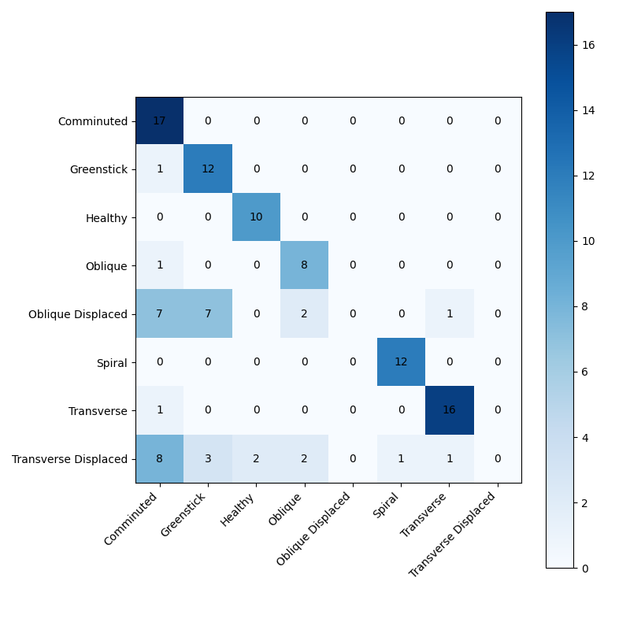
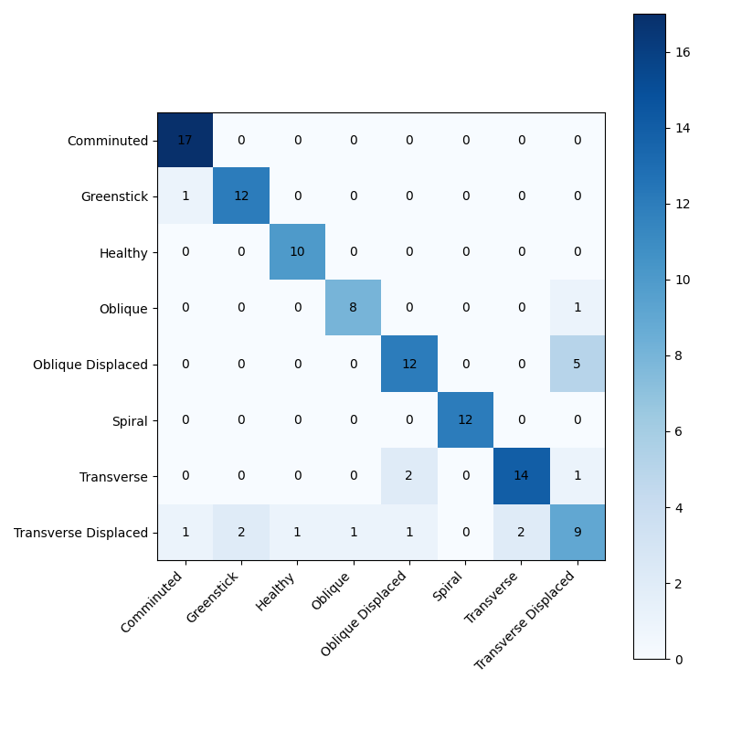
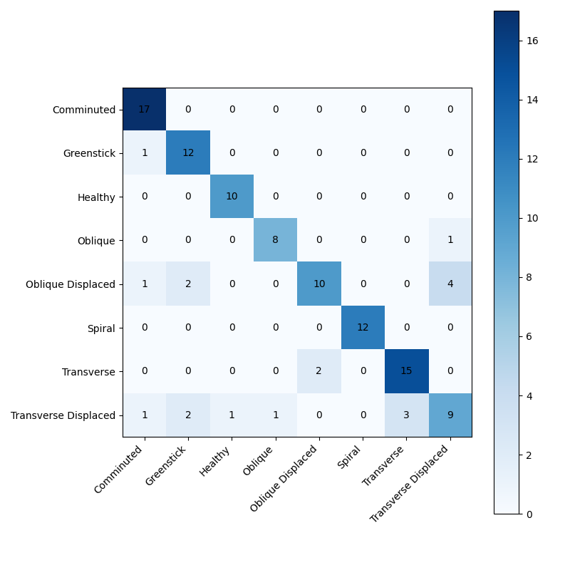
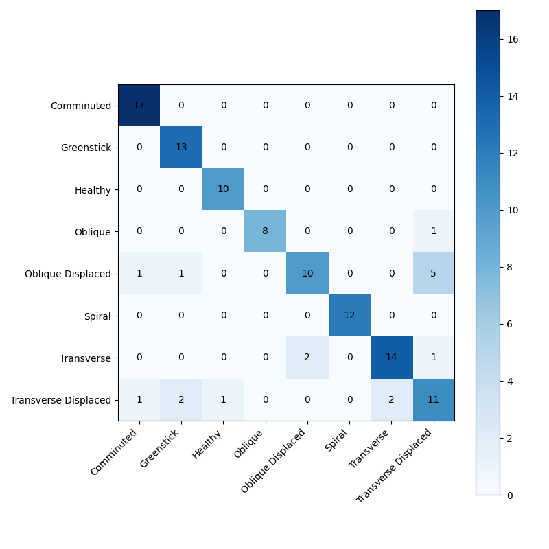

# Fracture Detection Model Benchmark Results

**Date:** 2025-11-30

## 1. Performance Summary

| Model | Macro F1 | Oblique F1 | Oblique Displaced F1 | Transverse F1 | Transverse Displaced F1 |
| :--- | :---: | :---: | :---: | :---: | :---: |
| **Swin Transformer** | **0.611** | 0.762 | 0.000 | 0.914 | 0.000 |
| **HyperColumn-DenseNet (Old)** | **0.872** | 0.889 | 0.774 | 0.882 | 0.667 |
| **HyperColumn-DenseNet (Focal)** | **0.852** | 0.889 | 0.750 | 0.848 | 0.545 |
| **Ensemble (All)** | **0.839** | 0.889 | 0.690 | 0.857 | 0.581 |
| **Ensemble (HyperColumns Only)** | **0.863** | 0.941 | 0.690 | 0.848 | 0.629 |

## 2. Detailed Analysis

### Swin Transformer
- **Checkpoint**: `best_swin.pth`
- **Macro F1**: 0.6106

#### Per-Class Metrics
| Class | Precision | Recall | F1-Score |
| :--- | :---: | :---: | :---: |
| Comminuted | 0.486 | 1.000 | 0.654 |
| Greenstick | 0.545 | 0.923 | 0.686 |
| Healthy | 0.833 | 1.000 | 0.909 |
| Oblique | 0.667 | 0.889 | 0.762 |
| Oblique Displaced | 0.000 | 0.000 | 0.000 |
| Spiral | 0.923 | 1.000 | 0.960 |
| Transverse | 0.889 | 0.941 | 0.914 |
| Transverse Displaced | 0.000 | 0.000 | 0.000 |

---
### HyperColumn-DenseNet (Old)
- **Checkpoint**: `best_hypercolumn_densenet169_old.pth`
- **Macro F1**: 0.8719

#### Per-Class Metrics
| Class | Precision | Recall | F1-Score |
| :--- | :---: | :---: | :---: |
| Comminuted | 0.895 | 1.000 | 0.944 |
| Greenstick | 0.765 | 1.000 | 0.867 |
| Healthy | 0.909 | 1.000 | 0.952 |
| Oblique | 0.889 | 0.889 | 0.889 |
| Oblique Displaced | 0.857 | 0.706 | 0.774 |
| Spiral | 1.000 | 1.000 | 1.000 |
| Transverse | 0.882 | 0.882 | 0.882 |
| Transverse Displaced | 0.769 | 0.588 | 0.667 |

---
### HyperColumn-DenseNet (Focal)
- **Checkpoint**: `best_hypercolumn_cbam_densenet169_focal.pth`
- **Macro F1**: 0.8523

#### Per-Class Metrics
| Class | Precision | Recall | F1-Score |
| :--- | :---: | :---: | :---: |
| Comminuted | 0.895 | 1.000 | 0.944 |
| Greenstick | 0.857 | 0.923 | 0.889 |
| Healthy | 0.909 | 1.000 | 0.952 |
| Oblique | 0.889 | 0.889 | 0.889 |
| Oblique Displaced | 0.800 | 0.706 | 0.750 |
| Spiral | 1.000 | 1.000 | 1.000 |
| Transverse | 0.875 | 0.824 | 0.848 |
| Transverse Displaced | 0.562 | 0.529 | 0.545 |

---
### Ensemble (All)
- **Checkpoint**: `Ensemble (All)`
- **Macro F1**: 0.8394

#### Per-Class Metrics
| Class | Precision | Recall | F1-Score |
| :--- | :---: | :---: | :---: |
| Comminuted | 0.850 | 1.000 | 0.919 |
| Greenstick | 0.750 | 0.923 | 0.828 |
| Healthy | 0.909 | 1.000 | 0.952 |
| Oblique | 0.889 | 0.889 | 0.889 |
| Oblique Displaced | 0.833 | 0.588 | 0.690 |
| Spiral | 1.000 | 1.000 | 1.000 |
| Transverse | 0.833 | 0.882 | 0.857 |
| Transverse Displaced | 0.643 | 0.529 | 0.581 |

---
### Ensemble (HyperColumns Only)
- **Checkpoint**: `Ensemble (HC Only)`
- **Macro F1**: 0.8627

#### Per-Class Metrics
| Class | Precision | Recall | F1-Score |
| :--- | :---: | :---: | :---: |
| Comminuted | 0.895 | 1.000 | 0.944 |
| Greenstick | 0.812 | 1.000 | 0.897 |
| Healthy | 0.909 | 1.000 | 0.952 |
| Oblique | 1.000 | 0.889 | 0.941 |
| Oblique Displaced | 0.833 | 0.588 | 0.690 |
| Spiral | 1.000 | 1.000 | 1.000 |
| Transverse | 0.875 | 0.824 | 0.848 |
| Transverse Displaced | 0.611 | 0.647 | 0.629 |

---
